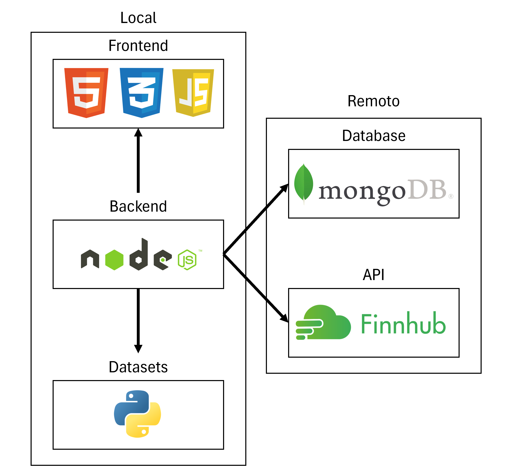

# **Documento de Requisitos**

**Proyecto:** Gestión de Transacciones y Búsqueda de Símbolos

## 1\. Objetivos

- Implementar un sistema eficiente para almacenar y gestionar transacciones financieras.
- Proporcionar herramientas de búsqueda rápidas y precisas para encontrar información sobre símbolos y compañías.
- Integrar una arquitectura escalable y modular para garantizar un rendimiento óptimo.

## 2\. Arqutiectura del Sistema

## 3\. Descripción de la Arquitectura del Sistema

El sistema está compuesto por los siguientes componentes principales, cada uno diseñado para cumplir una función específica y trabajar de manera integrada:

### **Frontend (HTML, CSS y JavaScript)**

- Interfaz de usuario para la interacción directa con el sistema.
- Diseñada con **HTML** para la estructura, **CSS** para el diseño visual y **JavaScript** para funcionalidades interactivas.
- Permite a los usuarios realizar búsquedas, registrar transacciones y visualizar resultados de manera dinámica.

### **Backend (Node.js)**

- Actúa como intermediario entre el frontend, Python y la base de datos MongoDB.
- Gestiona:
  - La lógica de negocio.
  - Las solicitudes del cliente.
  - La comunicación con APIs externas.
  - El enlace con los módulos de Python para búsquedas avanzadas.
- Se encarga de proporcionar servicios RESTful para que el frontend pueda acceder a las funcionalidades del sistema.

### **Procesamiento de Datos (Python)**

- Responsable de realizar búsquedas de símbolos y compañías en un dataset especializado.
- Realiza el procesamiento de datos para garantizar resultados rápidos y relevantes.
- Integrado con el backend para devolver resultados en tiempo real.

### **Base de Datos (MongoDB)**

- Sistema de almacenamiento NoSQL utilizado para gestionar transacciones financieras.
- Proporciona alta disponibilidad y escalabilidad para manejar grandes volúmenes de datos.
- Permite operaciones CRUD para mantener registros precisos y organizados.

### **Flujo de Datos**

1. El usuario interactúa con la **interfaz frontend** para realizar búsquedas o registrar transacciones.
2. El **backend (Node.js)** recibe y procesa las solicitudes, enviándolas a:
   - **Python**, para buscar símbolos y compañías en el dataset.
   - **MongoDB**, para almacenar o recuperar información sobre transacciones.
3. Si es necesario, el backend se conecta a una **API externa** para obtener información adicional y enriquecida.
4. Los resultados son procesados y enviados de vuelta al frontend para ser presentados al usuario.